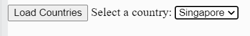

Instructions
Important: Do not modify the mocha and chai scripts, css and 

<h2> To run the test, *Only load the page and press the Run Test button* (The countries button options should not be loaded);
</h2>

Steps
When the Load Countries button is loaded, use axios to read in the countries information from countries.json
Create one <option> element for each country, setting the value attribute of each element to be the v key in each country object. That is,
Display all the <option> in the country <select>
Expected Output
image

The HTML for the <select> should look something like this:

 
 

<!-- <select id="countries">
    <option value="sg">Singapore</option>
    <option value="my">Malaysia</option>
</select> -->