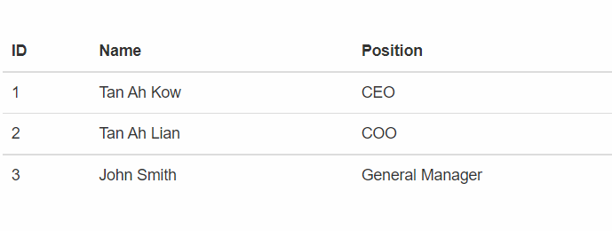

Instructions
To run the automated test, reload the page and then click on the Run Test button.

Steps
Use axios to read in the content of employees.json then
Display each employee on one row, showing the ID, name and position of the employee.
Expected Output

 
 
