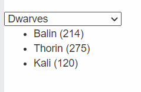

Instructions

Important: To run the test, reload your page or press the [Run] button, then click on [Run Test]

There are three JSON files, dwarves.json, elves.json and humans.json. The <select> dropdown allows the user to select one of them. When the user chooses any of the three, display in the <ul> the name and age for each character in the respective JSON file.

For example, if the user selects "Elves", they should see the following:

 
 

Hints:

Use the change event, instead of click to detect if the user has selected a new option for the <select> element.
Challenges

Solve this problem using only a single if statement.

Solve this problem without using any if statement.